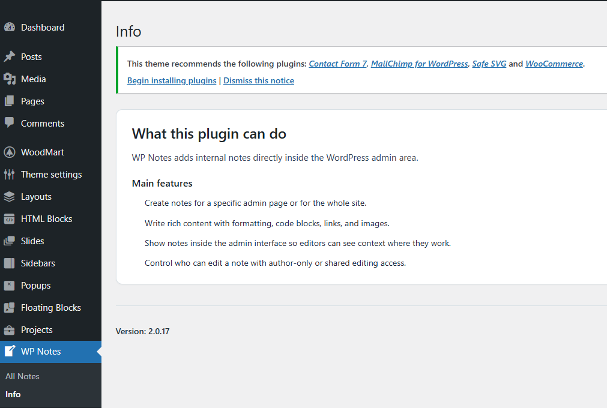
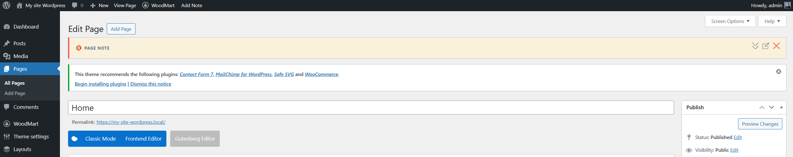
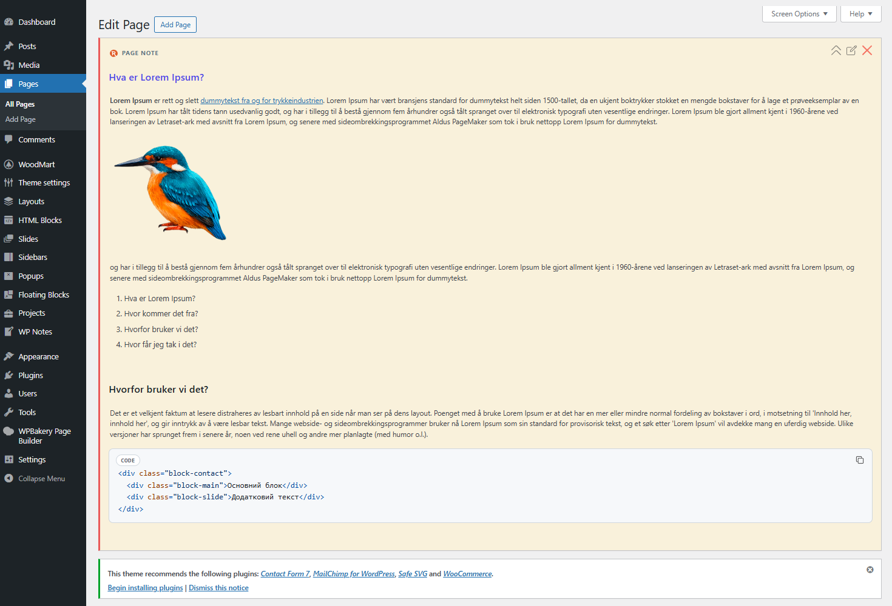
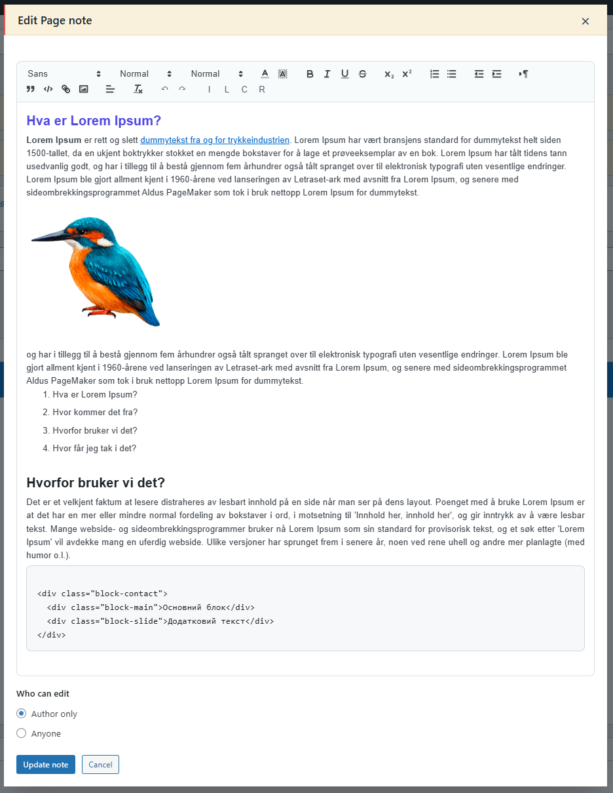
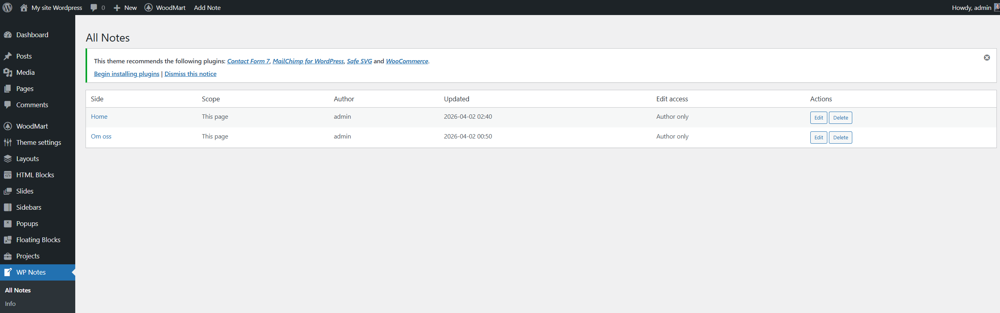

# WP Notes

WP Notes — це плагін для адміністративної панелі WordPress, який дозволяє створювати внутрішні нотатки безпосередньо в адмінці WordPress.

Він призначений для команд, яким потрібні контекстні нотатки на сторінках адмінки, редакційні нагадування, інструкції процесів або технічні коментарі, що залишаються всередині інтерфейсу адміністратора.

## Місця для скріншотів

За потреби вставте скріншоти в розділах нижче.

### Інформаційна сторінка

### Відображення нотатки в адмінці

### Модальне вікно редактора нотаток

### Сторінка всіх нотаток

## Основні можливості

- Створення нотатки для поточної сторінки адмінки.
- Створення глобальної нотатки для всього сайту.
- Відображення нотаток безпосередньо в адмінці WordPress.
- Керування нотатками зі спеціальної сторінки в адмінці.
- Редагування нотаток у модальному вікні або на окремій сторінці.
- Підтримка форматування тексту, списків, коду, посилань та зображень.
- Завантаження зображень прямо в нотатки.
- Контроль прав редагування для кожної нотатки.
- Використання мови WordPress для інтерфейсу плагіна.

## Як працює плагін

WP Notes додає меню в адмінці та елемент у верхній панелі WordPress.

З панелі адміністратора авторизований користувач може створювати:

- нотатку для конкретної сторінки
- глобальну нотатку для всієї адмінки

Коли нотатка існує, вона відображається у верхній частині сторінки як згортаний блок.

Користувачі з відповідними правами можуть:

- відкривати нотатку
- редагувати нотатку
- видаляти нотатку

Також є сторінка «All Notes», де всі нотатки можна переглядати та керувати ними.

## Зберігання даних

Плагін зберігає дані у двох місцях:

1. База даних WordPress
2. Директорія плагіна для зображень

### Таблиця бази даних

Плагін створює окрему таблицю:

- `{$wpdb->prefix}wp_notes`

У таблиці зберігається:

- тип нотатки
- унікальний ключ
- ID екрану
- URL сторінки
- заголовок сторінки
- вміст нотатки
- ID автора
- режим редагування
- дата створення
- дата оновлення

### Чи створює плагін нові таблиці?

Так.

Під час активації створюється таблиця:

- `wp_notes` з префіксом WordPress

### Правила унікальності

- одна глобальна нотатка
- одна нотатка на сторінку

## Де зберігаються дані

### Вміст нотатки

Зберігається в базі даних як очищений HTML.

### Завантажені зображення

Зберігаються у:

- `storage/uploads/`

Приклад:

- `wp-content/plugins/WP-Notes/storage/uploads/filename.png`

## Логіка роботи зображень

### При завантаженні

- файл перевіряється
- копіюється в `storage/uploads/`
- вставляється в контент

### При видаленні

Зображення видаляються якщо:

- вони більше не використовуються

## Права доступу

- `edit_pages` — доступ до плагіна
- `manage_options` — повний доступ

Режими нотатки:

- `author`
- `anyone`

## Інтерфейс

Плагін містить:

- швидкі дії в адмін-барі
- сторінку «All Notes»
- сторінку «Info»
- модальне редагування

## Редактор

Підтримує:

- заголовки
- жирний, курсив
- списки
- код
- посилання
- кольори
- зображення

## Бібліотеки

- Quill
- highlight.js

## Безпека

Контент очищується перед збереженням.

## Мови

- Англійська
- Норвезька

## Активація

- створення таблиці
- створення папок

## Видалення

Видаляє:

- всі нотатки
- всі зображення

## Структура

- `wp-notes.php`
- `includes/`
- `assets/`
- `storage/uploads/`

## Технічні нотатки

- працює тільки в адмінці
- зображення в плагіні

